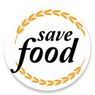

# Team 4 - Food Waste Management

# App: FoodSave
<div align="left">
  
</div>

## Team Members:
1. Charitha Gangaraju
2. Jitendra Rawat
3. Niyati Trivedi
4. Prithvi Karkera

## Overview
FoodSave is an Android application that is designed to address the issue of food wastage by donating extra food and notifying users about available food. This application will help students by sharing food and saving money.

**The link to the Idea Proposal:** 
https://docs.google.com/document/d/1p_MULypPV1GwtT9ycAXt5ETMKdIyZ5uMoMVKL7KNQu0/edit?usp=sharing   

**The link shows the basic workflow of the app:** 
https://drive.google.com/file/d/1C3ykWg1HSSV7b2w08rpMQU8bs27s_yOG/view?usp=drive_link  

**The link to the FInal Presentation:**
https://paceuniversity-my.sharepoint.com/:p:/r/personal/cg98718n_pace_edu/Documents/Food%20Save%20Presentation.pptx?d=w7f03989b4fd045e5b2cfca1abf81fcae&csf=1&web=1&e=KFDtvz

## Technologies used:
1.	Android Studio
2.	Kotlin
3.	Firebase
4.	Google Map APIs

## Key Features:
### SignUp:
- Created a Material design-based signup screen with user details and then this data is stored in Firebase Database.
<div align="center">
  
</div>

### LoginPage:
- Created a Login Page with email id and Password which is authenticated from Firebase Authentication.
<div align="center">
   
</div>

### Dashboard:
- ⁠The Dashboard screen shows all the different buttons for the user to navigate to different screens like Donate, Receive, FoodMap, Rewards, feedback Form.
<div align="center"> 
  
</div>

### Donate Screen:
- The Donate screen would ask the user to provide details of the food item to be donated such as Name of the food, description, and expiry of the food item.
- This data is stored in the backend in Firebase database with the live location of the donor.
<div align="center">
   </div>

### Food Map Screen:
- This screen would display the google map with Marker on the maps showing exact location and description of the product provided by the Donors.
⁠- It displays the live location of the user and displays the food data near to the live location of the user.
<div align="center">
  
</div>

### Receive Screen:
- This screen has a search bar for the user to select a particular food item and check if it is available.
- This data is provided from the Firebase Database which is saved at the donorRecords collection.
- Once the receiver chooses a particular food item, the marker would be removed from the google map and in the firebase, the record of the particular food item will be marked as isAvailable to false.
<div align="center">
  
</div>

### Rewards:
- In this section, the user would receive 50 Reward points for each donation made to the app and this would be displayed at the Reward screen with a redeem button where the user can redeem the points.
- The Reward screen also displays the different badges that would be earned on every 100 points.
<div align="center">
  
</div>

### Feedback Form:
- Receiver can provide their feedback and rating for the quality of food received and the donor details.
<div align="center">
   
</div>

### About Us:
- This screen provides the importance of the application.
<div align="center">
   
</div>

### Contact Us:
- This screen provides the contact details of FoodSave.
<div align="center">
  
</div>

To run the application locally; clone the repo and add your Google Map API key and connect to your firebase and run the app.
```
$ git clone https://github.com/CS639-Team-4-Final-Project/FoodSave
```
Firebase link: https://firebase.google.com/ 
